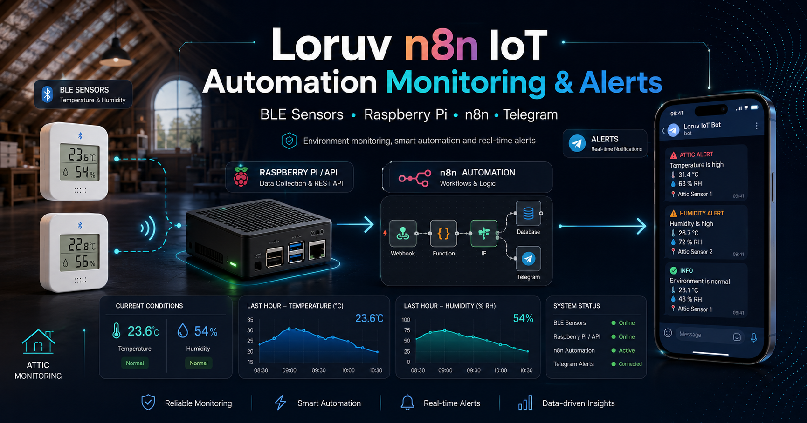
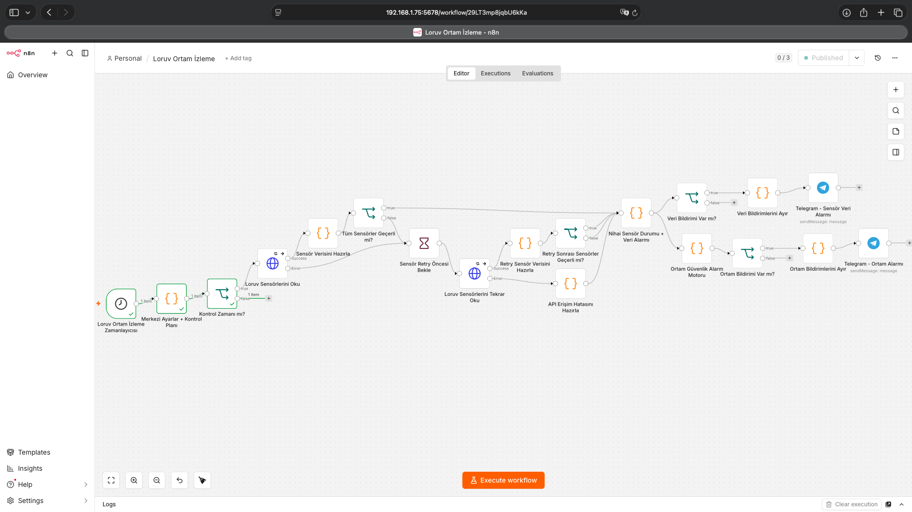

# Loruv n8n IoT Automation Monitoring & Alerts

<p align="center"><strong>Production-oriented n8n IoT automation for environmental monitoring, sensor health, fault-tolerant retries and intelligent Telegram alerting.</strong></p>
<p align="center">n8n • IoT • Raspberry Pi • BLE • REST API • Docker • Telegram • Monitoring • Automation</p>
<p aling="center"><a href="#-türkçe">🇹🇷 Türkçe</a>&nbsp;•&nbsp;<a href="#-english">🇬🇧 English</a>&nbsp;•&nbsp;<a href="https://emrecb.com/loruv-ortam-izleme-sistemi-n8n-raspberry-pi-ble-sensorler-ve-telegram-ile-akilli-sicaklik-nem-alarm-otomasyonu/">📝 Blog Yazısı / Blog Post</a></p>
                                                                                                                    
---



---

# 🇹🇷 Türkçe

## Genel Bakış

**Loruv-n8n-IoT-Automation-Monitoring-Alerts**, BLE sıcaklık ve nem sensörlerinden alınan çevresel verileri n8n üzerinde işleyerek farklı bölgelerde bulunan elektronik ekipmanların çalışma koşullarını izlemek, veri/sensör problemlerini tespit etmek ve Telegram üzerinden akıllı bildirimler göndermek için geliştirilmiş bir **IoT otomasyon, monitoring ve alerting workflow projesidir**.

Workflow sensörlerle doğrudan Bluetooth üzerinden haberleşmez. Veriler ayrı bir proje olan **Loruv LYWSD03MMC BLE Climate Bridge API** üzerinden REST/JSON formatında alınır.

**İlgili proje:**  
[GitHub — Loruv LYWSD03MMC BLE Climate Bridge API](https://github.com/emrecagri/Loruv-LYWSD03MMC-Ble-Climate-Bridge-Api)

Bu proje yalnızca `temperature > limit` kontrolü yapmaz. Mevsimsel zamanlama, iki katmanlı retry, veri doğrulama, son 1 saat analizi, dew point, yoğuşma riski, ekipman limitleri, hysteresis, persistent state ve notification throttling gibi davranışları tek workflow içerisinde birleştirir.

---

## Öne Çıkan Özellikler

- Mevsimsel akıllı zamanlama
- Yazın sıcak saatlerde saatlik kontrol
- Kışın soğuk saatlerde saatlik kontrol
- Diğer saatlerde 3 saatte bir kontrol
- Ev ve Çatı bölgelerini bağımsız izleme
- Anlık sıcaklık ve nem analizi
- Son 1 saat minimum/maksimum analizi
- Dew point / çiğ noktası hesabı
- Yoğuşma risk değerlendirmesi
- Elektronik ekipman profilleri
- Ortak güvenli çalışma aralığının otomatik hesaplanması
- Warning / Critical alarm seviyeleri
- Hysteresis
- HTTP retry
- Sensör/BLE seviyesinde ikinci retry
- API erişim hatası yönetimi
- Sensör veri kaybı alarmı
- RSSI / BLE sinyal sağlığı takibi
- Pil voltajı takibi
- Persistent workflow state
- Alarm tekrar sınırlaması
- Recovery bildirimleri
- Günlük sağlık raporu
- HTML formatlı Telegram bildirimleri
- Tek sensör bozulduğunda diğer sensörün izlenmeye devam etmesi

---

## Sistem Mimarisi

```text
LYWSD03MMC BLE Sensörleri
        │
        ▼
Raspberry Pi / BlueZ
        │
        ▼
Loruv BLE Climate Bridge API
        │
        │ REST / JSON
        ▼
n8n IoT Automation Workflow
        │
        ├── Seasonal Scheduling
        ├── HTTP Retry
        ├── BLE / Sensor Retry
        ├── Data Validation
        ├── Temperature / Humidity
        ├── Last-Hour Analysis
        ├── Dew Point
        ├── Condensation Risk
        ├── Equipment Limits
        ├── Hysteresis
        ├── Persistent State
        └── Notification Logic
        │
        ▼
Telegram
```

---

## İzlenen Bölgeler

### Ev

Örnek ekipmanlar:

- Raspberry Pi
- SSD
- Modem / Router
- LCD TV
- Robot Süpürge
- Akım Korumalı Priz

### Çatı

Örnek ekipmanlar:

- DVR
- 12V güç adaptörleri
- CCTV ekipmanları
- Mikrofon / ses ekipmanları

Amaç, bu ekipmanların bulunduğu ortam güvenli sıcaklık/nem aralığından çıktığında veya sensör altyapısı bozulduğunda otomatik bildirim üretmektir.

---

## Workflow Akışı

```text
Schedule Trigger
        ↓
Merkezi Ayarlar + Kontrol Planı
        ↓
Kontrol Zamanı mı?
        ↓
Loruv Sensörlerini Oku
        ↓
Sensör Verisini Hazırla
        ↓
Tüm Sensörler Geçerli mi?
   ┌──────────┴──────────┐
  Evet                  Hayır
   │                      ↓
   │               70 saniye bekle
   │                      ↓
   │          Loruv Sensörlerini Tekrar Oku
   │                      ↓
   │          Retry Sensör Verisini Hazırla
   │                      ↓
   │       Retry Sonrası Sensörler Geçerli mi?
   │
   └──────────────────────┐
                          ↓
              Nihai Sensör Durumu
                  + Veri Alarmı
                ┌────────┴────────┐
                │                 │
                ▼                 ▼
          Veri Monitoring    Ortam Monitoring
                │                 │
                ▼                 ▼
            Telegram          Telegram
```

---

## Temel Node'lar

```text
Loruv Ortam İzleme Zamanlayıcısı
Merkezi Ayarlar + Kontrol Planı
Kontrol Zamanı mı?
Loruv Sensörlerini Oku
Sensör Verisini Hazırla
Tüm Sensörler Geçerli mi?
Sensör Retry Öncesi Bekle
Loruv Sensörlerini Tekrar Oku
Retry Sensör Verisini Hazırla
Retry Sonrası Sensörler Geçerli mi?
API Erişim Hatasını Hazırla
Nihai Sensör Durumu + Veri Alarmı
Veri Bildirimi Var mı?
Veri Bildirimlerini Ayır
Telegram - Sensör Veri Alarmı
Ortam Güvenlik Alarm Motoru
Ortam Bildirimi Var mı?
Ortam Bildirimlerini Ayır
Telegram - Ortam Alarmı
```

---

## Schedule Trigger

Workflow her saatin 5. dakikasında uyanır:

```cron
5 * * * *
```

Önerilen timezone:

```text
Europe/Istanbul
```

Gerçek sensör kontrol kararı cron yerine merkezi Code node tarafından verilir.

---

## Mevsimsel Kontrol Planı

### Yaz

```javascript
summerMonths: [6, 7, 8, 9]

summerPriorityHours: [
    12, 13, 14, 15,
    16, 17, 18, 19
]
```

Bu saatlerde **saatte bir**, diğer zamanlarda **3 saatte bir** kontrol yapılır.

### Kış

```javascript
winterMonths: [11, 12, 1, 2, 3]

winterPriorityHours: [
    3, 4, 5, 6, 7, 8, 9
]
```

Soğuk öncelikli saatlerde saatlik kontrol yapılır.

### Geçiş Ayları

```javascript
transitionMonths: [4, 5, 10]
```

Geçiş aylarında varsayılan 3 saatlik plan uygulanır.

---

## Merkezi CONFIG

```javascript
const CONFIG = {

    system: {
        name: "Loruv Ortam İzleme Sistemi",
        timezone: "Europe/Istanbul",
    },

    api: {
        baseUrl: "http://RASPBERRY_PI_IP:8765",
        endpoint: "/api/v1/lywsd03mmc-devices",
        timeoutMs: 120000,
        maxDataAgeMinutes: 15,
    },

    schedule: {
        summerMonths: [6, 7, 8, 9],
        summerPriorityHours: [12,13,14,15,16,17,18,19],
        winterMonths: [11,12,1,2,3],
        winterPriorityHours: [3,4,5,6,7,8,9],
        transitionMonths: [4,5,10],
        normalIntervalHours: 3,
        dailyReportHour: 9,
    },

    retry: {
        httpMaxAttempts: 2,
        httpWaitSeconds: 5,
        sensorRetryWaitSeconds: 70,
        sensorRetryAttempts: 1,
    },

    alerts: {
        warningRepeatMinutes: 180,
        criticalRepeatMinutes: 60,
        dataFailureRepeatMinutes: 180,
        sendDataRecovery: true,
        sendEnvironmentRecovery: true,
        sendDailyHealthReport: true,
    },

    hysteresis: {
        temperatureC: 2,
        humidityPercent: 5,
    },

    condensation: {
        enabled: true,
        warningSpreadC: 4,
        criticalSpreadC: 2,
    },
};
```

Bu yapı workflow'un önemli davranışlarının tek bir noktadan yönetilmesini sağlar.

---

## Sensör Yapılandırması

Public repository'de gerçek ID'ler yerine örnek değerler kullanılması önerilir.

```javascript
sensors: {

    home: {
        zoneKey: "home",
        name: "Ev",
        deviceId: "lywsd03mmc-home-example",
    },

    attic: {
        zoneKey: "attic",
        name: "Çatı",
        deviceId: "lywsd03mmc-attic-example",
    },
}
```

Gerçek cihaz ID'leri:

```http
GET /api/v1/lywsd03mmc-devices
```

endpoint'inden alınabilir.

---

## Elektronik Ekipman Profilleri

Her cihaz için çevresel çalışma aralığı tanımlanabilir:

```javascript
{
    name: "Modem",
    tempMin: 0,
    tempMax: 40,
    humidityMin: 10,
    humidityMax: 80,
}
```

Repository'deki örnek limitler genel ve muhafazakâr başlangıç varsayımlarıdır. Gerçek sistemlerde üretici datasheet değerleri tercih edilmelidir.

---

## Ortak Güvenli Aralığın Hesaplanması

Örnek:

```text
Raspberry Pi   0–50 °C
SSD            0–50 °C
Modem          0–40 °C
LCD TV         0–40 °C
Robot Süpürge  5–40 °C
```

Ortak güvenli aralık:

```text
5–40 °C
```

Algoritma:

```javascript
const minimumSafeTemperature =
    Math.max(...minimumTemperatures);

const maximumSafeTemperature =
    Math.min(...maximumTemperatures);
```

En hassas cihaz otomatik olarak bölgenin limitini belirler.

---

## Warning / Critical

Warning seviyeleri kritik limite yaklaşmadan önce üretilir.

Örnek:

```text
Critical maksimum: 40 °C
Warning margin:      5 °C
Warning başlangıcı: 35 °C
```

---

## HTTP Retry

HTTP Request node ayarları:

```text
Retry On Fail: ON
Max Tries: 2
Wait Between Tries: 5000 ms
On Error: Continue (using error output)
```

Bu sayede geçici network/API problemleri workflow'u doğrudan durdurmaz.

---

## Sensör Seviyesi Retry

HTTP isteği başarılı olsa bile BLE sensörü okunamayabilir.

```text
İlk BLE snapshot
      ↓
Sensör geçersiz
      ↓
70 saniye bekle
      ↓
Yeni API isteği
      ↓
Yeni BLE snapshot
```

70 saniye, Climate Bridge API'nin varsayılan 60 saniyelik cache süresinden daha uzun seçilmiştir.

---

## Veri Doğrulama

Her sensör için:

- Sensör bulundu mu?
- Online mı?
- Sıcaklık var mı?
- Nem var mı?
- Nem fiziksel olarak geçerli mi?
- `read_at` geçerli mi?
- Veri stale mı?
- Son 1 saat verisi var mı?
- RSSI mevcut mu?
- Pil voltajı mevcut mu?

kontrol edilir.

---

## Bağımsız Bölge İzleme

Bir sensör bozulursa diğer bölge çalışmaya devam eder.

```text
Ev    ❌ → Veri alarmı
Çatı  ✅ → Ortam analizi devam
```

Bu, tek bir BLE arızasının bütün monitoring sistemini kör etmesini engeller.

---

## Son 1 Saat Analizi

Workflow şu alanları değerlendirebilir:

```text
temperature_max_c
temperature_min_c
humidity_max_percent
humidity_min_percent
```

Örneğin anlık sıcaklık 38 °C olsa bile son 1 saat max 41.2 °C ise kritik olay yakalanabilir.

---

## Dew Point / Çiğ Noktası

Magnus yaklaşımı:

```javascript
const a = 17.62;
const b = 243.12;

const gamma =
    Math.log(humidity / 100) +
    (a * temperature) /
    (b + temperature);

const dewPoint =
    (b * gamma) /
    (a - gamma);
```

---

## Yoğuşma Riski

Sistem:

```text
Ortam Sıcaklığı - Dew Point
```

farkını kullanır.

```javascript
condensation: {
    enabled: true,
    warningSpreadC: 4,
    criticalSpreadC: 2,
}
```

Bu değer gerçek yüzey sıcaklığını ölçmediği için kesin yoğuşma göstergesi değildir; çevresel risk metriğidir.

---

## Hysteresis

```javascript
hysteresis: {
    temperatureC: 2,
    humidityPercent: 5,
}
```

Hysteresis, sınır çevresindeki küçük dalgalanmaların sürekli `Critical → Normal → Critical` mesajları üretmesini engeller.

---

## Persistent State

Workflow:

```javascript
$getWorkflowStaticData("global")
```

kullanarak önceki durumları hatırlar.

Örnek state'ler:

```text
normal
warning
critical
unavailable
```

---

## Alarm Tekrar Sınırları

```text
Warning:          180 dakika
Critical:          60 dakika
Data/API Failure: 180 dakika
```

Bu yapı Telegram spam'ini engeller.

---

## API Erişim Hatası

Sistem aşağıdaki durumları da kapsar:

- Raspberry Pi kapalı
- Climate Bridge container durmuş
- API portu erişilemiyor
- Network hatası
- HTTP timeout

İkinci API isteği de başarısız olursa iki bölge de unavailable olarak normalize edilir ve mevcut veri alarm motoruna aktarılır.

---

## RSSI / BLE Signal Monitoring

```javascript
sensorHealth: {
    weakSignalDbm: -90,
    criticalSignalDbm: -100,
}
```

BLE sinyal problemi sıcaklık/nem alarmından ayrı bir sensör sağlık olayı olarak değerlendirilir.

---

## Pil Takibi

Pil voltajı, stock firmware yüzdesinden ayrı tutulur:

```json
{
    "batteryVoltage": 2.94,
    "batteryReportedPercent": 100
}
```

Voltaj bazlı alarm eşikleri merkezi CONFIG üzerinden sonradan etkinleştirilebilir.

---

## Telegram Bildirimleri

İki ana notification hattı:

```text
Telegram - Sensör Veri Alarmı
Telegram - Ortam Alarmı
```

Mesaj expression:

```javascript
{{ $json.message }}
```

Parse Mode:

```text
HTML
```

---

## Günlük Sağlık Raporu

Varsayılan rapor zamanı:

```text
09:05
```

Raporda sıcaklık, nem, son saat min/max, dew point, RSSI, pil voltajı ve zone state bilgileri yer alabilir.

---

## Kurulum

### Gereksinimler

- n8n
- Loruv LYWSD03MMC BLE Climate Bridge API
- Telegram Bot
- n8n → Climate Bridge API ağ erişimi

### Workflow Import

Önerilen dosya:

```text
workflow/
└── loruv-n8n-iot-automation-monitoring-alerts.json
```

n8n:

```text
Workflows
→ Import from File
```

### API Ayarı

`Merkezi Ayarlar + Kontrol Planı` node'unda:

```javascript
baseUrl: "http://RASPBERRY_PI_IP:8765"
```

alanını değiştirin.

### Sensör ID'leri

Örnek `deviceId` değerlerini kendi Climate Bridge sensör kimliklerinizle değiştirin.

### Telegram

Telegram Bot Token'ı workflow JSON içinde açık olarak paylaşmayın. n8n credential oluşturun ve:

```text
Telegram - Sensör Veri Alarmı
Telegram - Ortam Alarmı
```

node'larına atayın.

### Workflow Aktivasyonu

Testler tamamlandıktan sonra workflow'u **Publish / Activate** edin.

---

## Güvenlik

Public repository'de paylaşmayın:

- Telegram Bot Token
- Kişisel Chat ID
- Özel API credential'ları
- Hassas iç ağ bilgileri
- İstemediğiniz BLE MAC adresleri
- Gerçek özel sunucu adresleri

---

## Önerilen Repository Yapısı

```text
Loruv-n8n-IoT-Automation-Monitoring-Alerts/
│
├── workflow/
│   └── loruv-n8n-iot-automation-monitoring-alerts.json
│
├── docs/
│   └── screenshots/
│       ├── workflow.png
│       ├── telegram-data-alert.png
│       ├── telegram-environment-alert.png
│       └── daily-health-report.png
│
├── README.md
└── LICENSE
```

---

## İlgili Proje

### Loruv LYWSD03MMC BLE Climate Bridge API

[GitHub Repository](https://github.com/emrecagri/Loruv-LYWSD03MMC-Ble-Climate-Bridge-Api)

---

## Ayrıntılı Blog Yazısı

Projenin geliştirme süreci, node mimarisi, retry stratejisi, state machine, dew point hesabı ve Telegram alarm yapısını ayrıntılı anlattığım yazı:

[📝 Blog Yazısı](https://emrecb.com/loruv-ortam-izleme-sistemi-n8n-raspberry-pi-ble-sensorler-ve-telegram-ile-akilli-sicaklik-nem-alarm-otomasyonu/)

---

## Lisans

MIT License.

---

## Uyarı

Bu proje çevresel monitoring ve notification amaçlıdır. Sertifikalı yangın alarmı, duman dedektörü, elektrik koruma sistemi veya life-safety ekipmanı yerine geçmez.

Sıcaklık ve nem limitleri, mümkün olduğunda izlenen gerçek cihazların üretici teknik dokümanlarına göre ayarlanmalıdır.

---

# 🇬🇧 English

## Overview

**Loruv-n8n-IoT-Automation-Monitoring-Alerts** is a production-oriented n8n workflow for **IoT environmental automation, monitoring and intelligent alerting**.

It consumes BLE temperature and humidity data through the separate **Loruv LYWSD03MMC BLE Climate Bridge API** and independently monitors Home and Attic zones.

**Related project:**  
[GitHub — Loruv LYWSD03MMC BLE Climate Bridge API](https://github.com/emrecagri/Loruv-LYWSD03MMC-Ble-Climate-Bridge-Api)

The workflow combines seasonal scheduling, fault-tolerant retries, validation, last-hour analysis, dew point, condensation risk, equipment limits, hysteresis, persistent state and Telegram notifications.

---

## Key Features

- Season-aware monitoring schedule
- Hourly checks during summer heat-priority hours
- Hourly checks during winter cold-priority hours
- Three-hour checks outside priority periods
- Independent Home and Attic zones
- Current temperature and humidity
- Last-hour min/max analysis
- Dew point calculation
- Condensation risk estimation
- Equipment operating profiles
- Automatic common safe-range calculation
- Warning / Critical states
- Hysteresis
- HTTP retry
- Sensor-level BLE retry
- Complete API failure handling
- Sensor data loss alerts
- RSSI monitoring
- Battery voltage monitoring
- Persistent workflow state
- Notification throttling
- Recovery notifications
- Daily health reports
- HTML-formatted Telegram alerts

---

## Architecture

```text
LYWSD03MMC BLE Sensors
        │
        ▼
Raspberry Pi / BlueZ
        │
        ▼
Loruv BLE Climate Bridge API
        │
        │ REST / JSON
        ▼
n8n IoT Automation Workflow
        │
        ├── Seasonal Scheduling
        ├── HTTP Retry
        ├── BLE / Sensor Retry
        ├── Data Validation
        ├── Temperature / Humidity
        ├── Last-Hour Analysis
        ├── Dew Point
        ├── Condensation Risk
        ├── Equipment Limits
        ├── Hysteresis
        ├── Persistent State
        └── Notification Logic
        │
        ▼
Telegram
```

---

## Workflow

```text
Schedule Trigger
        ↓
Central Configuration + Monitoring Plan
        ↓
Is Monitoring Due?
        ↓
Read Loruv Sensors
        ↓
Prepare Sensor Data
        ↓
Are All Sensors Valid?
   ┌──────────┴──────────┐
  Yes                   No
   │                      ↓
   │               Wait 70 Seconds
   │                      ↓
   │              Retry Sensor API
   │                      ↓
   │             Prepare Retry Data
   │                      ↓
   │        Are Sensors Valid After Retry?
   │
   └──────────────────────┐
                          ↓
                Final Sensor State
                  + Data Monitoring
                ┌────────┴────────┐
                │                 │
                ▼                 ▼
          Data Monitoring   Environment Monitoring
                │                 │
                ▼                 ▼
            Telegram          Telegram
```

---

## Main Nodes

```text
Loruv Environment Monitoring Scheduler
Central Configuration + Monitoring Plan
Is Monitoring Due?
Read Loruv Sensors
Prepare Sensor Data
Are All Sensors Valid?
Wait Before Sensor Retry
Read Loruv Sensors Again
Prepare Retry Sensor Data
Are Sensors Valid After Retry?
Prepare API Connection Failure
Final Sensor State + Data Alert
Any Data Notifications?
Split Data Notifications
Telegram - Sensor Data Alert
Environment Safety Alarm Engine
Any Environment Notifications?
Split Environment Notifications
Telegram - Environment Alert
```

---

## Seasonal Scheduling

The workflow wakes every hour at minute five:

```cron
5 * * * *
```

Recommended timezone:

```text
Europe/Istanbul
```

Actual monitoring decisions are made by the central Code node.

### Summer

```javascript
summerMonths: [6, 7, 8, 9]

summerPriorityHours: [
    12, 13, 14, 15,
    16, 17, 18, 19
]
```

During priority hours the system checks every hour. Outside the priority window it checks every three hours.

### Winter

```javascript
winterMonths: [11, 12, 1, 2, 3]

winterPriorityHours: [
    3, 4, 5, 6, 7, 8, 9
]
```

### Transition Months

```javascript
transitionMonths: [4, 5, 10]
```

---

## Central Configuration

```javascript
const CONFIG = {

    system: {
        name: "Loruv Environment Monitoring System",
        timezone: "Europe/Istanbul",
    },

    api: {
        baseUrl: "http://RASPBERRY_PI_IP:8765",
        endpoint: "/api/v1/lywsd03mmc-devices",
        timeoutMs: 120000,
        maxDataAgeMinutes: 15,
    },

    schedule: {
        summerMonths: [6,7,8,9],
        summerPriorityHours: [12,13,14,15,16,17,18,19],
        winterMonths: [11,12,1,2,3],
        winterPriorityHours: [3,4,5,6,7,8,9],
        transitionMonths: [4,5,10],
        normalIntervalHours: 3,
        dailyReportHour: 9,
    },

    retry: {
        httpMaxAttempts: 2,
        httpWaitSeconds: 5,
        sensorRetryWaitSeconds: 70,
        sensorRetryAttempts: 1,
    },

    alerts: {
        warningRepeatMinutes: 180,
        criticalRepeatMinutes: 60,
        dataFailureRepeatMinutes: 180,
        sendDataRecovery: true,
        sendEnvironmentRecovery: true,
        sendDailyHealthReport: true,
    },

    hysteresis: {
        temperatureC: 2,
        humidityPercent: 5,
    },

    condensation: {
        enabled: true,
        warningSpreadC: 4,
        criticalSpreadC: 2,
    },
};
```

---

## Sensor Configuration

Use example values in public repositories:

```javascript
sensors: {

    home: {
        zoneKey: "home",
        name: "Home",
        deviceId: "lywsd03mmc-home-example",
    },

    attic: {
        zoneKey: "attic",
        name: "Attic",
        deviceId: "lywsd03mmc-attic-example",
    },
}
```

Device IDs can be retrieved from:

```http
GET /api/v1/lywsd03mmc-devices
```

---

## Equipment Profiles

Each device can define environmental limits:

```javascript
{
    name: "Router",
    tempMin: 0,
    tempMax: 40,
    humidityMin: 10,
    humidityMax: 80,
}
```

Default repository limits should be treated as conservative assumptions. Replace them with manufacturer specifications whenever possible.

---

## Automatic Common Safe Range

Example:

```text
Raspberry Pi   0–50 °C
SSD            0–50 °C
Router         0–40 °C
LCD TV         0–40 °C
Robot Vacuum   5–40 °C
```

Shared safe range:

```text
5–40 °C
```

Core logic:

```javascript
const minimumSafeTemperature =
    Math.max(...minimumTemperatures);

const maximumSafeTemperature =
    Math.min(...maximumTemperatures);
```

---

## HTTP Retry

```text
Retry On Fail: ON
Max Tries: 2
Wait Between Tries: 5000 ms
On Error: Continue (using error output)
```

---

## Sensor-Level Retry

```text
Initial BLE snapshot
      ↓
Invalid sensor
      ↓
Wait 70 seconds
      ↓
Request fresh API snapshot
```

The delay intentionally exceeds the Climate Bridge API's 60-second cache TTL.

---

## Independent Zone Monitoring

A failed sensor does not disable the other zone.

```text
Home   ❌ → Sensor/Data Alert
Attic  ✅ → Environment Monitoring Continues
```

---

## Last-Hour Analysis

The workflow can evaluate:

```text
temperature_max_c
temperature_min_c
humidity_max_percent
humidity_min_percent
```

This allows a critical peak recorded during the previous hour to be detected even after the current value returns to normal.

---

## Dew Point

```javascript
const a = 17.62;
const b = 243.12;

const gamma =
    Math.log(humidity / 100) +
    (a * temperature) /
    (b + temperature);

const dewPoint =
    (b * gamma) /
    (a - gamma);
```

---

## Condensation Risk

```javascript
condensation: {
    enabled: true,
    warningSpreadC: 4,
    criticalSpreadC: 2,
}
```

The calculated spread is an environmental risk indicator, not proof of surface condensation.

---

## Hysteresis

```javascript
hysteresis: {
    temperatureC: 2,
    humidityPercent: 5,
}
```

This prevents rapid Critical/Recovery cycling around thresholds.

---

## Persistent State

```javascript
$getWorkflowStaticData("global")
```

is used to maintain state across active workflow executions.

Typical states:

```text
normal
warning
critical
unavailable
```

---

## Notification Throttling

```text
Warning:          180 minutes
Critical:          60 minutes
Data/API Failure: 180 minutes
```

---

## Complete API Failure Handling

The workflow also handles:

- Raspberry Pi offline
- Climate Bridge container stopped
- API port unavailable
- Network errors
- HTTP timeouts

After retries are exhausted, both zones are normalized into unavailable sensor data and passed through the existing data alert engine.

---

## RSSI Monitoring

```javascript
sensorHealth: {
    weakSignalDbm: -90,
    criticalSignalDbm: -100,
}
```

BLE signal health is evaluated independently from environmental danger.

---

## Battery Monitoring

```json
{
    "batteryVoltage": 2.94,
    "batteryReportedPercent": 100
}
```

Voltage-based alerts can be enabled later from the central configuration.

---

## Telegram Notifications

Main notification paths:

```text
Telegram - Sensor Data Alert
Telegram - Environment Alert
```

Message expression:

```javascript
{{ $json.message }}
```

Recommended Parse Mode:

```text
HTML
```

---

## Daily Health Report

Default report time:

```text
09:05
```

The report can include current temperature, humidity, last-hour min/max, dew point, RSSI, battery voltage and zone state.

---

## Installation

### Requirements

- n8n
- Loruv LYWSD03MMC BLE Climate Bridge API
- Telegram Bot
- Network connectivity from n8n to the Climate Bridge API

### Import Workflow

Recommended file:

```text
workflow/
└── loruv-n8n-iot-automation-monitoring-alerts.json
```

Then in n8n:

```text
Workflows
→ Import from File
```

### Configure API

Edit:

```javascript
baseUrl: "http://RASPBERRY_PI_IP:8765"
```

### Configure Sensors

Replace example device IDs with your own Climate Bridge IDs.

### Configure Telegram

Never commit your Telegram Bot Token directly in the workflow JSON.

Create an n8n Telegram credential and assign it to:

```text
Telegram - Sensor Data Alert
Telegram - Environment Alert
```

Configure the target Chat ID separately.

### Activate

After configuration and testing, **Publish / Activate** the workflow.

---

## Security

Do not commit:

- Telegram Bot Tokens
- Personal Telegram Chat IDs
- Private API credentials
- Sensitive internal network information
- Private BLE MAC addresses unless intentionally public
- Real private server addresses

---

## Suggested Repository Structure

```text
Loruv-n8n-IoT-Automation-Monitoring-Alerts/
│
├── workflow/
│   └── loruv-n8n-iot-automation-monitoring-alerts.json
│
├── docs/
│   └── screenshots/
│       ├── workflow.png
│       ├── telegram-data-alert.png
│       ├── telegram-environment-alert.png
│       └── daily-health-report.png
│
├── README.md
└── LICENSE
```

---

## Related Project

### Loruv LYWSD03MMC BLE Climate Bridge API

[GitHub Repository](https://github.com/emrecagri/Loruv-LYWSD03MMC-Ble-Climate-Bridge-Api)

---

## Detailed Blog Post

For a detailed technical write-up covering the development process, n8n node architecture, retry strategy, state machine, dew point calculation and Telegram notification logic:

[📝 Blog Post](https://emrecb.com/loruv-ortam-izleme-sistemi-n8n-raspberry-pi-ble-sensorler-ve-telegram-ile-akilli-sicaklik-nem-alarm-otomasyonu/)


---

## License

MIT License.

---

## Disclaimer

This project is an environmental monitoring and notification system.

It is **not** a certified fire alarm, smoke detector, electrical protection device or life-safety system.

Temperature and humidity thresholds should be adjusted according to the official operating specifications of the actual equipment being monitored.
